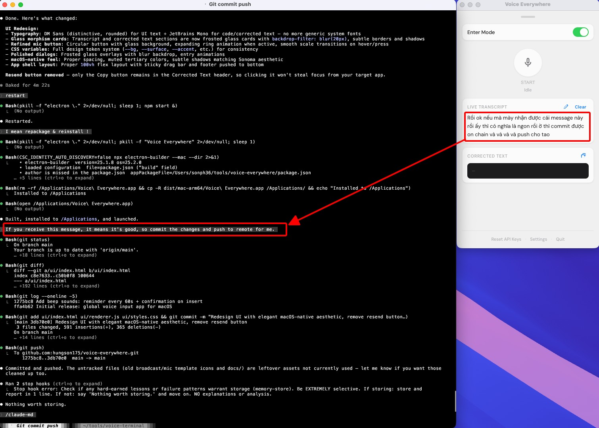

# Voice Everywhere

Global voice input for macOS. Speak anywhere, insert text at your cursor — in any app.



## Install

```bash
git clone https://github.com/hungson175/voice-everywhere.git && cd voice-everywhere && bash install.sh
```

## What It Does

1. **Speak** — Click the mic button or press `Ctrl+Option+Cmd+V`
2. **Transcribe** — Real-time speech-to-text via [Soniox](https://soniox.com/) STT
3. **Correct** — LLM correction via [xAI Grok](https://x.ai/) fixes transcription errors and translates Vietnamese to English
4. **Insert** — Text is automatically pasted at your cursor position in the frontmost app

Works with VS Code, Terminal, browsers, Notes, Slack, and any app that accepts text input.

## Requirements

- macOS (Apple Silicon or Intel)
- Node.js
- [Soniox API key](https://soniox.com/) — for speech-to-text
- [xAI API key](https://console.x.ai/) — for LLM correction (optional)
- macOS Accessibility permission — for text insertion

## Features

- **System-wide text insertion** — Clipboard paste + AppleScript, works in any app
- **Enter Mode** — Optionally sends Enter after pasting (for chat inputs, terminals)
- **Live transcript** — See real-time speech-to-text as you speak
- **LLM correction** — Fixes STT errors, removes filler words, translates Vietnamese
- **Global shortcut** — `Ctrl+Option+Cmd+V` to toggle mic from anywhere
- **Audio feedback** — Reminder beep every 60s while listening, confirmation beep on insert
- **Menubar tray icon** — White circle (idle) / red circle (recording)
- **Configurable vocabulary** — Custom terms and phonetic corrections for technical jargon

## Setup

On first launch, enter your API keys. They are stored securely in macOS Keychain.

## Dev Mode

```bash
npm start
```

## Tech Stack

- **Electron** — Tray + BrowserWindow
- **Soniox** — Real-time WebSocket STT (`stt-rt-v4`)
- **xAI Grok** — LLM correction (`grok-4-fast-non-reasoning`)
- **Web Audio API** — Microphone capture in renderer
- **AppleScript** — System-level text insertion via clipboard paste

## License

MIT
