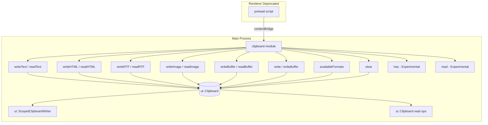

# Electron Clipboard API — Electron 38 (Main Process JavaScript)

**Commit SHA:** `a839fb94aa9f56e865857e3b853d4a62f4d93144`
**Source:** [electron/electron/blob/main/docs/api/clipboard.md](https://github.com/electron/electron/blob/a839fb94aa9f56e865857e3b853d4a62f4d93144/docs/api/clipboard.md)
**Implementation:** [shell/common/api/electron_api_clipboard.cc](https://github.com/electron/electron/blob/a839fb94aa9f56e865857e3b853d4a62f4d93144/shell/common/api/electron_api_clipboard.cc)

---

## Quick Reference

```js
const { clipboard } = require('electron')
```

| Method | Returns | Experimental |
|--------|---------|--------------|
| `clipboard.readText([type])` | `string` | No |
| `clipboard.writeText(text[, type])` | `void` | No |
| `clipboard.readHTML([type])` | `string` | No |
| `clipboard.writeHTML(markup[, type])` | `void` | No |
| `clipboard.readRTF([type])` | `string` | No |
| `clipboard.writeRTF(text[, type])` | `void` | No |
| `clipboard.readImage([type])` | `NativeImage` | No |
| `clipboard.writeImage(image[, type])` | `void` | No |
| `clipboard.readBookmark()` | `{ title, url }` | No |
| `clipboard.writeBookmark(title, url[, type])` | `void` | No |
| `clipboard.availableFormats([type])` | `string[]` | No |
| `clipboard.has(format[, type])` | `boolean` | **Yes** |
| `clipboard.read(format)` | `string` | **Yes** |
| `clipboard.readBuffer(format)` | `Buffer` | **Yes** |
| `clipboard.writeBuffer(format, buffer[, type])` | `void` | **Yes** |
| `clipboard.clear([type])` | `void` | No |
| `clipboard.write(data[, type])` | `void` | No |

**`type` parameter:** `selection` | `clipboard` (default: `clipboard`). `selection` is Linux-only (X11 selection clipboard).

---

## Method Details

### `clipboard.availableFormats([type])` ✅ Stable

**Signature:**
```javascript
clipboard.availableFormats(type?: 'selection' | 'clipboard'): string[]
```

**Returns:** Array of MIME-type strings supported by the clipboard (e.g., `['text/plain', 'text/html', 'image/png']`).

**Source** ([electron_api_clipboard.cc L59-78](https://github.com/electron/electron/blob/a839fb94aa9f56e865857e3b853d4a62f4d93144/shell/common/api/electron_api_clipboard.cc#L59-L78)):
```cpp
std::vector<std::u16string> Clipboard::AvailableFormats(gin::Arguments* const args) {
  std::vector<std::u16string> format_types;
  ui::Clipboard* clipboard = ui::Clipboard::GetForCurrentThread();
  // Uses GetAllAvailableFormats + async read + RunLoop
  // ...
}
```

**Limitation (from docs):** On Windows, may return inconsistent results — sometimes empty array, sometimes all possible formats.

---

### `clipboard.readBuffer(format)` ✅ Experimental

**Signature:**
```javascript
clipboard.readBuffer(format: string): Buffer
```

**Returns:** Raw bytes as Node.js `Buffer` for the specified MIME format.

**Example** ([docs](https://github.com/electron/electron/blob/a839fb94aa9f56e865857e3b853d4a62f4d93144/docs/api/clipboard.md#L232-L248)):
```javascript
const { clipboard } = require('electron')
const ret = clipboard.readBuffer('public.utf8-plain-text')
console.log(ret) // <Buffer 74 68 69 73 20 69 73 20 62 69 6e 61 72 79>
```

**Source** ([electron_api_clipboard.cc L177-181](https://github.com/electron/electron/blob/a839fb94aa9f56e865857e3b853d4a62f4d93144/shell/common/api/electron_api_clipboard.cc#L177-L181)):
```cpp
v8::Local<v8::Value> Clipboard::ReadBuffer(v8::Isolate* const isolate,
                                            const std::string& format_string) {
  std::string data = Read(format_string);  // delegates to Read()
  return electron::Buffer::Copy(isolate, data).ToLocalChecked();
}
```

---

### `clipboard.writeBuffer(format, buffer[, type])` ✅ Experimental

**Signature:**
```javascript
clipboard.writeBuffer(format: string, buffer: Buffer, type?: 'selection' | 'clipboard'): void
```

**Requirements:** `buffer` **must** be a Node.js `Buffer` (checked via `node::Buffer::HasInstance`). Throws `TypeError` if not.

**Source** ([electron_api_clipboard.cc L183-201](https://github.com/electron/electron/blob/a839fb94aa9f56e865857e3b853d4a62f4d93144/shell/common/api/electron_api_clipboard.cc#L183-L201)):
```cpp
void Clipboard::WriteBuffer(const std::string& format,
                            const v8::Local<v8::Value> buffer,
                            gin::Arguments* const args) {
  if (!node::Buffer::HasInstance(buffer)) {
    args->ThrowTypeError("buffer must be a node Buffer");
    return;
  }
  // Copies buffer contents into mojo_base::BigBuffer and writes via ScopedClipboardWriter
  // writer.WriteUnsafeRawData(base::UTF8ToUTF16(format), std::move(big_buffer));
}
```

---

### `clipboard.readText([type])` / `clipboard.writeText(text[, type])` ✅ Stable

**Signatures:**
```javascript
clipboard.readText(type?: 'selection' | 'clipboard'): string
clipboard.writeText(text: string, type?: 'selection' | 'clipboard'): void
```

**Example:**
```javascript
clipboard.writeText('hello i am a bit of text!')
const text = clipboard.readText() // 'hello i am a bit of text!'
```

**Windows fallback:** If `text/plain` is unavailable but `text/plain.atom` exists, reads as ASCII text.

---

### `clipboard.readHTML([type])` / `clipboard.writeHTML(markup[, type])` ✅ Stable

**Signatures:**
```javascript
clipboard.readHTML(type?: 'selection' | 'clipboard'): string
clipboard.writeHTML(markup: string, type?: 'selection' | 'clipboard'): void
```

**Note:** `readHTML` returns only the fragment markup (not the full HTML document). Chromium wraps HTML with `<meta charset='utf-8'>` when writing, so output includes this.

**Example:**
```javascript
clipboard.writeHTML('<b>Hi</b>')
const html = clipboard.readHTML()
// <meta charset='utf-8'><b>Hi</b>
```

---

### `clipboard.readRTF([type])` / `clipboard.writeRTF(text[, type])` ✅ Stable

**Signatures:**
```javascript
clipboard.readRTF(type?: 'selection' | 'clipboard'): string
clipboard.writeRTF(text: string, type?: 'selection' | 'clipboard'): void
```

---

### `clipboard.readImage([type])` / `clipboard.writeImage(image[, type])` ✅ Stable

**Signatures:**
```javascript
clipboard.readImage(type?: 'selection' | 'clipboard'): NativeImage
clipboard.writeImage(image: NativeImage, type?: 'selection' | 'clipboard'): void
```

**Critical limitation:** `readImage` is only available **after app ready** in the main process.

**Source** ([electron_api_clipboard.cc L360-393](https://github.com/electron/electron/blob/a839fb94aa9f56e865857e3b853d4a62f4d93144/shell/common/api/electron_api_clipboard.cc#L360-L393)):
```cpp
gfx::Image Clipboard::ReadImage(gin::Arguments* const args) {
  if (IsBrowserProcess() && !Browser::Get()->is_ready()) {
    gin_helper::ErrorThrower{args->isolate()}.ThrowError(
        "clipboard.readImage is available only after app ready in the main process");
    return {};
  }
  // Reads as PNG, decodes to gfx::Image
}
```

---

### `clipboard.write(data[, type])` ✅ Stable (Multi-format Write)

**Signature:**
```javascript
clipboard.write(data: {
  text?: string
  html?: string
  image?: NativeImage
  rtf?: string
  bookmark?: string  // title of URL at text
}, type?: 'selection' | 'clipboard'): void
```

**Purpose:** Write multiple formats atomically. Apps can paste whichever format is appropriate.

**Example:**
```javascript
clipboard.write({
  text: 'test',
  html: '<b>Hi</b>',
  rtf: '{\\rtf1\\utf8 text}',
  bookmark: 'a title'
})
console.log(clipboard.readText())  // 'test'
console.log(clipboard.readHTML())  // <meta charset='utf-8'><b>Hi</b>
console.log(clipboard.readRTF())  // '{\\rtf1\\utf8 text}'
```

---

### `clipboard.clear([type])` ✅ Stable

```javascript
clipboard.clear(type?: 'selection' | 'clipboard'): void
```

---

### Platform-Specific Methods

| Method | Platform |
|--------|----------|
| `clipboard.readBookmark()` / `clipboard.writeBookmark()` | macOS, Windows |
| `clipboard.readFindText()` / `clipboard.writeFindText()` | macOS only |
| `selection` clipboard type | Linux only (X11) |

---

## Limitations Summary

| Limitation | Detail |
|------------|--------|
| **No native snapshot/restore** | Electron has no built-in `clipboard.snapshot()` or `clipboard.restore()`. You must implement manually. |
| **`readImage` requires app ready** | Cannot call before `app.whenReady()` in main process |
| **`writeBuffer` requires Buffer type** | Passing a non-Buffer throws `TypeError: buffer must be a node Buffer` |
| **`availableFormats` inconsistent on Windows** | May return empty or all possible formats; not reliable for presence checks |
| **Experimental APIs may be removed** | `has()`, `read()`, `readBuffer()`, `writeBuffer()` marked experimental |
| **Renderer process deprecated** | Using clipboard directly in renderer is deprecated; must use preload + contextBridge |

---

## Snapshot/Restore Pattern (Manual Implementation)

Since Electron provides no native snapshot/restore, implement it manually using the available APIs:

```javascript
// In main process — snapshot current clipboard
function snapshotClipboard() {
  const formats = clipboard.availableFormats()
  const snapshot = {}
  
  for (const format of formats) {
    try {
      if (format.startsWith('text/')) {
        snapshot[format] = clipboard.readText()
      } else if (format.startsWith('image/')) {
        snapshot[format] = clipboard.readImage()  // Note: requires app ready
      } else {
        // Use experimental readBuffer for unknown formats
        snapshot[format] = clipboard.readBuffer(format)
      }
    } catch (e) {
      console.warn(`Failed to read format ${format}:`, e.message)
    }
  }
  return snapshot
}

// In main process — restore from snapshot
function restoreClipboard(snapshot) {
  clipboard.clear()
  
  for (const [format, value] of Object.entries(snapshot)) {
    try {
      if (format === 'text/plain') {
        clipboard.writeText(value)
      } else if (format === 'text/html') {
        clipboard.writeHTML(value)
      } else if (format.startsWith('image/')) {
        clipboard.writeImage(value)
      } else {
        // Use experimental writeBuffer for unknown formats
        clipboard.writeBuffer(format, Buffer.from(value))
      }
    } catch (e) {
      console.warn(`Failed to write format ${format}:`, e.message)
    }
  }
}
```

**Note:** This snapshot pattern has limitations:
- `readBuffer`/`writeBuffer` are experimental
- Custom/arbitrary formats may not serialize correctly via JSON (snapshot is not truly portable)
- `NativeImage` objects (from `readImage`) are not JSON-serializable — would need to encode as PNG base64

---

## Architecture Diagram



---

## References

- Official docs: [github.com/electron/electron/blob/main/docs/api/clipboard.md](https://github.com/electron/electron/blob/a839fb94aa9f56e865857e3b853d4a62f4d93144/docs/api/clipboard.md)
- Implementation: [shell/common/api/electron_api_clipboard.cc](https://github.com/electron/electron/blob/a839fb94aa9f56e865857e3b853d4a62f4d93144/shell/common/api/electron_api_clipboard.cc)
- Header: [shell/common/api/electron_api_clipboard.h](https://github.com/electron/electron/blob/a839fb94aa9f56e865857e3b853d4a62f4d93144/shell/common/api/electron_api_clipboard.h)
