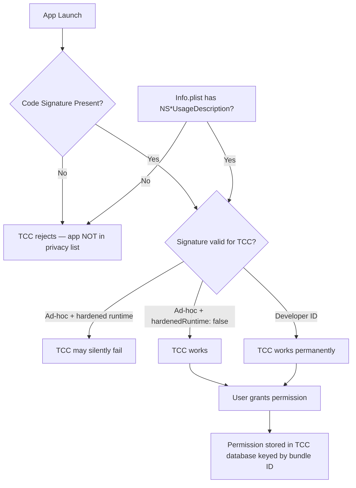

# Electron/macOS TCC Permission Issue: App Not Appearing in Privacy Lists

**Date:** 26 Mar 2026
**Repo:** voice-everywhere (this codebase)

---

## Summary of Root Causes

| Cause | Affected Scenario | Evidence |
|-------|------------------|----------|
| **Unsigned app bundle** | `npm start` (dev) + `CSC_IDENTITY_AUTO_DISCOVERY=false` builds | [Issue #728](https://github.com/pingdotgg/t3code/issues/728) — TCC requires a code signature to register the app |
| **Missing `NSAccessibilityUsageDescription`** | Packaged app, Accessibility pane | This repo's `package.json` lacks it |
| **App translocation breaking ad-hoc signatures** | Downloaded unsigned `.app` moved to `/Applications` | [electron-builder#9529](https://github.com/electron-userland/electron-builder/issues/9529) |
| **electron-builder v26+ hardened runtime breaking ad-hoc** | Ad-hoc signed builds since v26.0.13 | [electron-builder#9529](https://github.com/electron-userland/electron-builder/issues/9529) comment chain |

---

## 1. `electron .` / `npm start` vs Packaged `.app`

### Why Dev Mode Doesn't Show in TCC Lists

Running `electron .` from the source directory does **not** create a proper `.app` bundle. Electron launches directly from the unpacked `electron/main.js` with:

- No embedded `Info.plist` with usage descriptions presented to TCC
- The Electron binary itself is signed by Electron.org, but **your app's identity** (bundle ID, product name) is not embedded in a signed app bundle
- macOS TCC attributes permissions to the **app bundle identity**, not the process name

**Evidence** ([electron-builder#9062](https://github.com/electron-userland/electron-builder/issues/9062)):
> granting accessibility permissions directly to "ApplicationName.app" should work... the key issue is that this permission is not being acquired by the subprocess that actually needs it

When you run `electron .`, TCC sees the Electron binary's signature (Electron.org), not your app's bundle identity. The permissions you grant go to Electron, not to your app.

### The Fix for Dev Mode

**Option A (Temporary):** Grant permission to the Electron binary:
```bash
# Find Electron binary and grant accessibility
codesign --force --deep --sign - /path/to/Electron.app
```

**Option B (Preferred for dev):** Build a `.app` with proper signing before testing TCC:
```bash
npm run build:dir  # builds to dist/mac/*.app
codesign --force --deep --sign - dist/mac/Voice\ to\ Text.app
open dist/mac/Voice\ to\ Text.app
```

---

## 2. Code Signing / Bundle Identity / App Translocation

### The Three States of Electron macOS Builds

| Build Type | Signature State | TCC Registration | App Appears in Privacy List? |
|------------|----------------|-----------------|------------------------------|
| Dev (`electron .`) | Electron binary signed | Yes, but identity is Electron.org, not your app | ❌ Wrong identity |
| `CSC_IDENTITY_AUTO_DISCOVERY=false` (unsigned) | **No signature at all** | ❌ None — TCC can't attribute | ❌ Not listed |
| `mac.identity: "-"` (ad-hoc) | Ad-hoc signature (`-`) | ✅ Yes, but fragile | ⚠️ Works, but breaks on translocation |
| `mac.identity: "Developer ID Application: ..."` (proper) | Developer ID signature | ✅ Yes, permanent | ✅ Yes |

### App Translocation

macOS **app translocation** is a security feature where downloaded apps are copied to a randomized path (e.g., `/var/folders/.../...app`) before execution, to prevent exploit chaining from predictable paths.

**Problem:** Ad-hoc signed apps (`codesign --sign -`) produce a signature that **changes** when the binary moves. The signature is tied to the file's location, not an stable developer identity. After translocation, the signature is effectively invalidated.

**Evidence** ([electron-builder#9529 comment](https://github.com/electron-userland/electron-builder/issues/9529#issuecomment-2323650479)):
> One thing your analysis doesn't mention: the --deep flag in codesign is important because Electron apps have nested binaries

> Also, for the unsigned builds issue - ad-hoc signing (identity '-') is definitely the right call over no signing at all. The difference is significant: unsigned binaries get no TCC identity at all, while ad-hoc signed binaries get a unique identity that TCC can record.

**The only robust fix** is a **Developer ID certificate** from the Apple Developer Program ($99/year). This produces a signature tied to your team + bundle ID, not the file path.

### electron-builder v26+ Regression

Since v26.0.13, electron-builder changed how ad-hoc signing works. Ad-hoc signed builds with `hardenedRuntime: true` (the default) silently fail to deliver camera/mic audio.

**Workarounds** from the community ([electron-builder#9529](https://github.com/electron-userland/electron-builder/issues/9529)):

**Workaround A — disable hardened runtime:**
```yaml
mac:
  hardenedRuntime: false
  identity: "-"
```

**Workaround B — post-build deep re-sign after packaging:**
```bash
sudo codesign --force --deep --sign - "/Applications/LIVI.app"
```

---

## 3. Unsigned/Dev Electron Apps — What macOS Shows

When an unsigned Electron app requests Accessibility permission, macOS shows the **Electron binary path**, not your app's name, because TCC uses the code signature to determine the app's human-readable name.

**Evidence** ([electron/electron#31490](https://github.com/electron/electron/issues/31490)):
> Manually signing app using following command fixes issue.
> `codesign --force --deep --sign - /Applications/QR\ Bridge.app`

The user noted the app appeared as "Electron" or the binary name in the Accessibility list, not their app's product name.

---

## 4. Best Practice: Proper Permission Prompting

### Required `Info.plist` Keys

Your `package.json` currently has:

```json
"extendInfo": {
  "NSMicrophoneUsageDescription": "Voice to Text needs microphone access for speech-to-text.",
  "NSAppleEventsUsageDescription": "Voice to Text needs accessibility to paste text into other apps."
}
```

**Missing key:** `NSAccessibilityUsageDescription` — required for Accessibility permission prompts to appear.

**Fix (add to `extendInfo`):**
```json
"NSAccessibilityUsageDescription": "Voice to Text needs accessibility permission to insert transcribed text at your cursor in any app."
```

### Required Entitlements

For microphone and camera access, your entitlements file (or `extendInfo`) must include:

```xml
<key>com.apple.security.device.audio-input</key>
<true/>
<key>com.apple.security.device.camera</key>
<true/>
```

Or via `extendInfo`:
```json
"com.apple.security.device.audio-input": true,
"com.apple.security.device.camera": true
```

### Code Signing Configuration

**Minimum viable config for TCC to work** (`package.json` `build.mac`):

```json
"mac": {
  "category": "public.app-category.productivity",
  "icon": "assets/icon.png",
  "target": ["dmg", "zip"],
  "hardenedRuntime": false,
  "identity": "-",
  "extendInfo": {
    "NSMicrophoneUsageDescription": "Voice to Text needs microphone access for speech-to-text.",
    "NSAppleEventsUsageDescription": "Voice to Text needs accessibility to paste text into other apps.",
    "NSAccessibilityUsageDescription": "Voice to Text needs accessibility permission to insert transcribed text at your cursor in any app.",
    "com.apple.security.device.audio-input": true
  }
}
```

**Proper config (with Developer ID):**
```json
"mac": {
  "hardenedRuntime": true,
  "identity": "Developer ID Application: Your Name (TEAMID)",
  "entitlements": "build/entitlements.mac.plist",
  "entitlementsInherit": "build/entitlements.mac.plist",
  "extendInfo": {
    "NSMicrophoneUsageDescription": "...",
    "NSAccessibilityUsageDescription": "...",
    "NSAppleEventsUsageDescription": "..."
  }
}
```

### Runtime Permission Request Flow

From `electron/macos-permissions.js` lines 52-69, the microphone flow is:

```javascript
async function ensureMicrophonePermission() {
  const status = systemPreferences.getMediaAccessStatus(MICROPHONE_MEDIA_TYPE);
  // ...
  if (isNotDeterminedStatus(status)) {
    const granted = await systemPreferences.askForMediaAccess(MICROPHONE_MEDIA_TYPE);
    // ...
  }
}
```

This is correct. The issue is that `systemPreferences.askForMediaAccess` triggers the macOS permission dialog **only if**:
1. The app bundle has a valid code signature
2. The `Info.plist` contains `NSMicrophoneUsageDescription`
3. The entitlements include `com.apple.security.device.audio-input`

If any of these are missing, the dialog silently fails or doesn't appear.

---

## 5. Current State of This Repo

**Found in `package.json` (lines 18-31):**

```json
"build": {
  "appId": "com.voiceeverywhere.app",
  "productName": "Voice to Text",
  "mac": {
    "extendInfo": {
      "NSMicrophoneUsageDescription": "...",
      "NSAppleEventsUsageDescription": "..."
    }
  }
}
```

### Issues Identified

| Issue | Location | Fix |
|-------|----------|-----|
| Missing `NSAccessibilityUsageDescription` | `package.json` `extendInfo` | Add `NSAccessibilityUsageDescription` |
| `CSC_IDENTITY_AUTO_DISCOVERY=false` disables signing | Build command (see `CLAUDE.md` line 14) | Use `mac.identity: "-"` with `hardenedRuntime: false` |
| No entitlements for audio input | `package.json` | Add `com.apple.security.device.audio-input: true` to `extendInfo` |
| electron-builder v25.1.8 (pre-regression) | `package.json` | Still works with ad-hoc signing, but should be tested with v26+ |

### Build Command Observation

From `CLAUDE.md` line 14:
```bash
CSC_IDENTITY_AUTO_DISCOVERY=false npx electron-builder --mac --dir
```

This **disables all signing** — the app bundle has no signature at all. TCC cannot and will not register an unsigned app in the privacy permission lists.

---

## Practical Fix Guidance

### For Development Testing

1. **Add missing `NSAccessibilityUsageDescription`** to `build.mac.extendInfo`
2. **Test with a packaged build**, not `npm start`:
   ```bash
   npm run build:dir
   # Then manually sign the produced .app:
   sudo codesign --force --deep --sign - dist/mac/Voice\ to\ Text.app
   open dist/mac/Voice\ to\ Text.app
   ```
3. Grant permissions to the signed `.app` in System Settings

### For Production Distribution

| Goal | Action |
|------|--------|
| Free / no Apple Developer account | Ad-hoc sign (`identity: "-"` + `hardenedRuntime: false`), accept that TCC works only when app is in original download location (not translocated) |
| Reliable TCC across all scenarios | Purchase Developer ID certificate ($99/year), use proper `identity: "Developer ID Application: ..."` |

### Entitlements Fix (add to `build.mac.extendInfo`)

```json
"com.apple.security.device.audio-input": true
```

This is required alongside `NSMicrophoneUsageDescription` for microphone capture to work. Without it, the OS may deny audio device access even after user grants permission.

---

## Key Source Links

| Topic | Source |
|-------|--------|
| TCC requires code signature | [pingdotgg/t3code#728](https://github.com/pingdotgg/t3code/issues/728) |
| electron-builder v26 ad-hoc regression | [electron-userland/electron-builder#9529](https://github.com/electron-userland/electron-builder/issues/9529) |
| Accessibility permission subprocess issue | [electron-userland/electron-builder#9062](https://github.com/electron-userland/electron-builder/issues/9062) |
| Ad-hoc signing + hardened runtime workaround | [electron-builder#9529 comment](https://github.com/electron-userland/electron-builder/issues/9529#issuecomment-2323650479) |
| Camera permission not persistent, fixed by ad-hoc sign | [electron/electron#31490](https://github.com/electron/electron/issues/31490) |
| BigBinary: requesting camera/mic in Electron | [bigbinary.com](https://www.bigbinary.com/blog/request-camera-micophone-permission-electron) |

---

## Mermaid: TCC Permission Flow



---

*Report generated: 26 Mar 2026*
*Research artifact: `electron-macos-tcc-permission-research_18.04_26-03-2026.md`*
