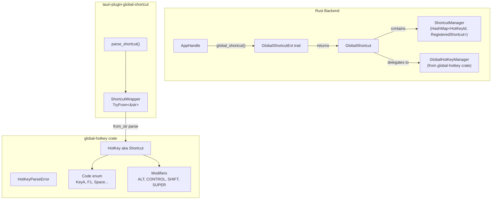

# tauri-plugin-global-shortcut v2 API Research

**Research Date:** 2026-03-28
**Plugin Version:** 2.3.1
**Underlying Crate:** `global-hotkey` v0.7

---

## Overview

The `tauri-plugin-global-shortcut` v2 plugin enables applications to register and manage system-wide keyboard shortcuts on Windows, Linux, and macOS desktop platforms. It wraps the [`global-hotkey`](https://crates.io/crates/global-hotkey) crate and exposes both Rust and JavaScript APIs.

**Key types:**
- `Shortcut` (aliased from `global_hotkey::hotkey::HotKey`) — the core shortcut type with `mods`, `key`, and `id` fields
- `ShortcutWrapper` — plugin-internal wrapper that implements `TryFrom<&str>` for string parsing
- `GlobalShortcut<R>` — the manager type obtained via `app.global_shortcut()`
- `GlobalShortcutExt` — trait that provides `global_shortcut()` on any `Manager<R>` implementor
- `Code` — physical key codes (e.g., `Code::KeyA`, `Code::F1`, `Code::Space`)
- `Modifiers` — modifier key flags (`ALT`, `CONTROL`, `SHIFT`, `SUPER`)
- `ShortcutState` — `Pressed` or `Released`
- `ShortcutEvent` — event emitted when a shortcut is triggered

---

## 1. Parsing a User-Provided Accelerator String into `Shortcut`

### Mechanism

The plugin uses the `FromStr` implementation on `Shortcut` (which is `HotKey` from `global-hotkey`). The conversion chain is:

```rust
// From lib.rs line 54-61 (tauri-apps/plugins-workspace)
impl TryFrom<&str> for ShortcutWrapper {
    type Error = global_hotkey::hotkey::HotKeyParseError;
    fn try_from(value: &str) -> Result<Self, Self::Error> {
        Shortcut::from_str(value).map(ShortcutWrapper)
    }
}
```

The `parse_shortcut` helper (line 313-315) is used internally:

```rust
fn parse_shortcut<S: AsRef<str>>(shortcut: S) -> Result<Shortcut> {
    shortcut.as_ref().parse().map_err(Into::into)
}
```

### Accelerator String Format

Accelerator strings follow the format: `<modifiers>+<key>` where modifiers are concatenated with `+` and the key comes last.

**Valid examples:**
- `"Ctrl+A"` / `"Control+A"` — Ctrl modifier + A key
- `"CommandOrControl+Shift+C"` — Ctrl or Cmd (platform-aware) + Shift + C
- `"Alt+F1"` — Alt modifier + F1
- `"Super+Space"` — Super (Windows/Command) + Space
- `"ctrl+shift+escape"` — lowercase also works
- `"CommandOrControl+Shift+Plus"` — note: `Plus` not `=`

**Modifier aliases (case-insensitive):**
| Alias | Meaning |
|-------|---------|
| `Ctrl`, `Control` | `CONTROL` modifier |
| `Alt`, `Option` | `ALT` modifier |
| `Shift` | `SHIFT` modifier |
| `Super`, `Cmd`, `Command`, `Meta`, `Windows` | `SUPER` modifier |
| `CommandOrControl`, `CommandOrControl+` | Platform-aware: `CONTROL` on Windows/Linux, `SUPER` on macOS |

**Important:** The key name must match a valid `Code` variant name from the `Code` enum (without the `Key` prefix for letter keys). For example, use `KeyA`, `KeyB`, `Digit1`, `F1`, `Space`, `Enter`, `Escape`, `Tab`, etc.

### Code Example: Parsing

```rust
use tauri_plugin_global_shortcut::{GlobalShortcutExt, ShortcutState};
use tauri::Manager;

fn setup_shortcut<R: tauri::Runtime>(app: &tauri::AppHandle<R>) -> Result<(), Box<dyn std::error::Error>> {
    let global_shortcut = app.global_shortcut();

    // Parse a user-provided string into Shortcut
    let user_input = "CommandOrControl+Shift+P";
    
    // The register and is_registered methods accept strings directly via TryInto<ShortcutWrapper>
    // They call parse_shortcut internally
    global_shortcut.register(user_input)?;

    Ok(())
}
```

**Error handling:** Parsing returns `Err(HotKeyParseError)` if the string is malformed. The error can be converted to a string via `.to_string()`.

---

## 2. Unregistering and Registering at Runtime via `AppHandle/global_shortcut()`

### Getting the GlobalShortcut Handle

```rust
use tauri_plugin_global_shortcut::GlobalShortcutExt;

let global_shortcut = app.global_shortcut();
// or from any Tauri Manager implementor:
let gs = app.global_shortcut();
```

### Runtime Registration

```rust
// Register a single shortcut (no handler)
global_shortcut.register("Ctrl+N")?;

// Register with a handler
global_shortcut.on_shortcut("Ctrl+N", |app, shortcut, event| {
    if event.state == ShortcutState::Pressed {
        println!("Ctrl+N triggered");
    }
})?;

// Register multiple shortcuts
global_shortcut.register_multiple(["Ctrl+1", "Ctrl+2", "Ctrl+3"])?;

// Register multiple with shared handler
global_shortcut.on_shortcuts(
    ["F1", "F2", "F3"],
    |app, shortcut, event| {
        println!("Function key {} pressed", shortcut.into_string());
    }
)?;
```

### Runtime Unregistration

```rust
// Unregister a single shortcut
global_shortcut.unregister("Ctrl+N")?;

// Unregister multiple shortcuts
global_shortcut.unregister_multiple(["Ctrl+1", "Ctrl+2", "Ctrl+3"])?;

// Unregister ALL registered shortcuts
global_shortcut.unregister_all()?;
```

### Complete Replace-Old-With-New Pattern

```rust
use tauri_plugin_global_shortcut::GlobalShortcutExt;

fn replace_shortcut<R: tauri::Runtime>(
    app: &tauri::AppHandle<R>,
    old_accel: &str,
    new_accel: &str,
) -> Result<(), Box<dyn std::error::Error>> {
    let gs = app.global_shortcut();
    
    // Unregister old if it exists
    if gs.is_registered(old_accel) {
        gs.unregister(old_accel)?;
    }
    
    // Register new
    gs.register(new_accel)?;
    
    Ok(())
}
```

### Tauri Command Pattern (for frontend invocation)

```rust
#[tauri::command]
fn update_shortcut(
    app: tauri::AppHandle,
    old_shortcut: String,
    new_shortcut: String,
) -> Result<(), String> {
    let gs = app.global_shortcut();
    
    // Check before unregistering to avoid errors
    if gs.is_registered(&old_shortcut) {
        gs.unregister(&old_shortcut).map_err(|e| e.to_string())?;
    }
    
    gs.register(&new_shortcut).map_err(|e| e.to_string())?;
    Ok(())
}
```

---

## 3. Checking Whether a Shortcut Is Already Registered

### Rust API: `is_registered`

```rust
use tauri_plugin_global_shortcut::GlobalShortcutExt;

fn check_and_maybe_register<R: tauri::Runtime>(
    app: &tauri::AppHandle<R>,
    accel: &str,
) -> Result<(), Box<dyn std::error::Error>> {
    let gs = app.global_shortcut();
    let shortcut = "Ctrl+Shift+L";

    if gs.is_registered(shortcut) {
        println!("{} is already registered", shortcut);
    } else {
        gs.on_shortcut(shortcut, |app, shortcut, event| {
            println!("Lock screen shortcut activated");
        })?;
        println!("{} registered successfully", shortcut);
    }
    Ok(())
}
```

**Important caveat from the documentation:**

> Determines whether the given shortcut is registered by this application or not. **If the shortcut is registered by another application, it will still return `false`.**

This means `is_registered` only checks if YOUR app has registered this shortcut, not system-wide availability.

### JavaScript API: `isRegistered`

```typescript
import { isRegistered } from '@tauri-apps/plugin-global-shortcut';

const registered = await isRegistered('CommandOrControl+P');
if (registered) {
    console.log('Print shortcut is active');
} else {
    console.log('Print shortcut is not registered by this app');
}
```

---

## 4. macOS-Specific Caveats

### Accessibility Permissions Required

On macOS, global shortcuts require the app to have **Accessibility permissions** enabled (System Settings → Privacy & Security → Accessibility). Without this, shortcuts may not fire.

From issue [#2868](https://github.com/tauri-apps/plugins-workspace/issues/2868):

> When I registered for the global media shortcut, I opened the accessibility feature of MacOS but still received an error message.

The plugin does not automatically request Accessibility permission. Your app must guide users to enable it in System Settings.

### Double-Firing Events

From issue [#10025](https://github.com/tauri-apps/tauri/issues/10025) and [#1748](https://github.com/tauri-apps/plugins-workspace/issues/1748):

> **[v2][bug] Global shortcut event fire twice on macOS**

This is a known issue — the event handler may be called twice when a shortcut is pressed on macOS. A workaround is to check `event.state` and only act on `Pressed`:

```rust
app.global_shortcut().on_shortcut("Ctrl+S", |_app, _shortcut, event| {
    if event.state == ShortcutState::Pressed {
        // Only handle on Pressed to avoid double-fire
        println!("Save triggered");
    }
})?;
```

### Handler Called Twice Even Without Duplicate Registration

Issue [#1748](https://github.com/tauri-apps/plugins-workspace/issues/1748) was closed as `not_planned`, indicating this may be inherent to the macOS implementation.

### Panic on Basic Setup (Fixed in Later Versions)

Issue [#2540](https://github.com/tauri-apps/plugins-workspace/issues/2540) reported panics with basic setup. This was fixed in later versions (2.3.x).

### Platform-Aware Modifier: `CommandOrControl`

On macOS, `CommandOrControl` maps to the `SUPER` modifier (Command key). On Windows/Linux, it maps to `CONTROL`. This is useful for cross-platform shortcuts:

```rust
// On macOS: Cmd+Shift+C
// On Windows/Linux: Ctrl+Shift+C
global_shortcut.register("CommandOrControl+Shift+C")?;
```

### App Sandbox and Entitlements

For a packaged macOS app, ensure the following are present in your entitlements if you distribute via DMG:

```xml
<key>com.apple.security.device.audio-input</key>
<true/>
```

Note: Global shortcuts don't require audio input, but if your app also does recording (like this STT app), the entitlement is needed for mic access.

---

## Capability/Permission Configuration

By default, all potentially dangerous plugin commands are blocked. You must enable them in your capabilities:

```json
// src-tauri/capabilities/default.json
{
  "$schema": "../gen/schemas/desktop-schema.json",
  "identifier": "main-capability",
  "description": "Capability for the main window",
  "windows": ["main"],
  "permissions": [
    "global-shortcut:allow-is-registered",
    "global-shortcut:allow-register",
    "global-shortcut:allow-unregister",
    "global-shortcut:allow-unregister-all"
  ]
}
```

Available permissions:
- `global-shortcut:allow-is-registered`
- `global-shortcut:allow-register`
- `global-shortcut:allow-register-all`
- `global-shortcut:allow-unregister`
- `global-shortcut:allow-unregister-all`

---

## Source References

| Content | Source |
|---------|--------|
| Plugin lib.rs (global-shortcut) | [tauri-apps/plugins-workspace@v2](https://github.com/tauri-apps/plugins-workspace/blob/v2/plugins/global-shortcut/src/lib.rs) |
| Shortcut type (HotKey from global-hotkey) | [global-hotkey 0.7.0 docs.rs](https://docs.rs/global-hotkey/0.7.0/global_hotkey/hotkey/struct.HotKey.html) |
| GlobalShortcut manager API | [docs.rs GlobalShortcut](https://docs.rs/tauri-plugin-global-shortcut/latest/tauri_plugin_global_shortcut/struct.GlobalShortcut.html) |
| GlobalShortcutExt trait | [docs.rs GlobalShortcutExt](https://docs.rs/tauri-plugin-global-shortcut/latest/tauri_plugin_global_shortcut/trait.GlobalShortcutExt.html) |
| Shortcut struct | [docs.rs Shortcut](https://docs.rs/tauri-plugin-global-shortcut/latest/tauri_plugin_global_shortcut/struct.Shortcut.html) |
| Code enum (physical key codes) | [docs.rs Code](https://docs.rs/tauri-plugin-global-shortcut/latest/tauri_plugin_global_shortcut/enum.Code.html) |
| Official plugin docs | [v2.tauri.app/plugin/global-shortcut](https://v2.tauri.app/plugin/global-shortcut/) |
| JS API reference | [v2.tauri.app/reference/javascript/global-shortcut](https://v2.tauri.app/reference/javascript/global-shortcut/) |

---

## Architecture Diagram



---

## Quick-Reference: Common Patterns

### Parse and Register
```rust
global_shortcut.register("Ctrl+Shift+P")?;
```

### Check Before Register
```rust
if !global_shortcut.is_registered("Ctrl+S") {
    global_shortcut.register("Ctrl+S")?;
}
```

### Replace Shortcut
```rust
global_shortcut.unregister(old)?;
global_shortcut.register(new)?;
```

### Get Handler on macOS (check state to avoid double-fire)
```rust
if event.state == ShortcutState::Pressed {
    // handle
}
```
