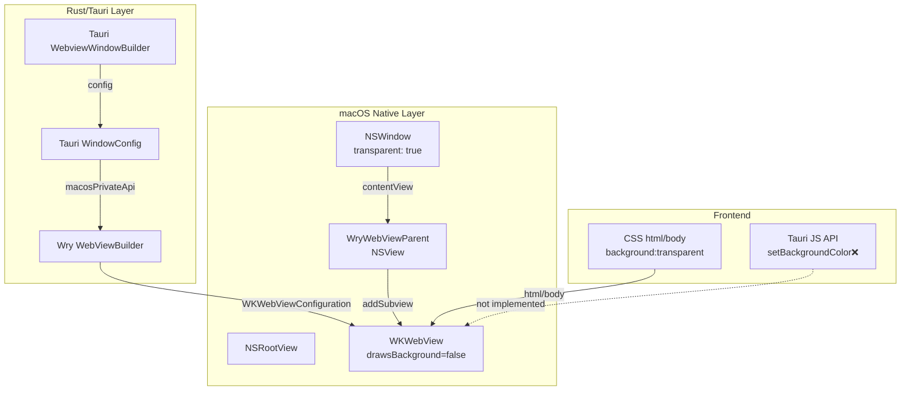

# Tauri v2 macOS Transparent HUD: White Opaque Background Fix

**Date**: 27-03-2026 11:34  
**Commit (Wry)**: `7c1a31dd0810308d4e19b11cf390ddf1ce6c30b4`  
**Focus**: WKWebView transparency for Tauri v2 macOS HUD window

---

## Executive Summary

The white opaque rectangle behind a transparent Tauri macOS HUD is caused by **WKWebView's default opaque white background** not being disabled. The fix requires:

1. **Wry `transparent` feature enabled** (uses private API `drawsBackground`)
2. **`macosPrivateApi: true`** in `tauri.conf.json`
3. **`transparent: true`** in window configuration
4. **Rust-side `set_background_color()`** call (JavaScript API does NOT work on macOS webview)

---

## Finding 1: WKWebView `drawsBackground` — Private API

**Claim**: WKWebView requires `setValue_forKey(false, "drawsBackground")` to become transparent.

**Evidence** ([wry/mod.rs#L367-384](https://github.com/tauri-apps/wry/blob/7c1a31dd0810308d4e19b11cf390ddf1ce6c30b4/src/wkwebview/mod.rs#L367-L384)):

```rust
#[cfg(feature = "transparent")]
if attributes.transparent || attributes.background_color.is_some() {
  let no = NSNumber::numberWithBool(false);
  #[cfg(target_os = "macos")]
  {
    let version = util::operating_system_version();
    if version.0 > 10 || (version.0 == 10 && version.1 >= 14) {
      // NOTE: Private API — `drawsBackground`.
      // Available: macOS 10.14+ (no public doc).
      config.setValue_forKey(Some(&no), ns_string!("drawsBackground"));
    }
  }
  // ...
}
```

**Explanation**: Wry calls `setValue_forKey` with the private KVC key `"drawsBackground"` set to `false` on the `WKWebViewConfiguration`. This is gated behind the `transparent` feature flag. Without this, WKWebView defaults to an opaque white background regardless of CSS.

---

## Finding 2: `set_background_color()` Runtime API on macOS

**Claim**: Wry's `set_background_color()` CAN disable the webview background at runtime, but only with `feature = "transparent"` enabled.

**Evidence** ([wry/mod.rs#L963-987](https://github.com/tauri-apps/wry/blob/7c1a31dd0810308d4e19b11cf390ddf1ce6c30b4/src/wkwebview/mod.rs#L963-L987)):

```rust
#[cfg(all(target_os = "macos", feature = "transparent"))]
unsafe {
  let (red, green, blue, alpha) = _background_color;

  // Disable the default white background using the same drawsBackground KVC key
  // as the `transparent` feature. On the webview instance (vs config) for runtime changes.
  // NOTE: Private API — `drawsBackground` is a private KVC key on WKWebView instance.
  let no = NSNumber::numberWithBool(false);
  self
    .webview
    .setValue_forKey(Some(&no), ns_string!("drawsBackground"));

  let (os_major_version, _, _) = util::operating_system_version();
  if os_major_version >= 12 {
    let color = objc2_app_kit::NSColor::colorWithSRGBRed_green_blue_alpha(/* ... */);
    // <https://developer.apple.com/documentation/webkit/wkwebview/underpagebackgroundcolor>
    // Available: macOS 12+, iOS 15+
    self.webview.setUnderPageBackgroundColor(Some(&color));
  }
}
```

**Explanation**: When `set_background_color()` is called at runtime, Wry applies `drawsBackground = false` to the **WKWebView instance** (not just the configuration). This is only compiled when both `target_os = "macos"` AND `feature = "transparent"` are set.

---

## Finding 3: Tauri JS API `setBackgroundColor()` — NOT IMPLEMENTED on macOS

**Claim**: The JavaScript API `setBackgroundColor()` in Tauri v2 does NOT work for the webview layer on macOS.

**Evidence** ([v2.tauri.app reference](https://v2.tauri.app/reference/javascript/api/namespacewebview)):

> **Platform-specific**:  
> - **macOS / iOS**: Not implemented for the webview layer.

And ([v2.tauri.app reference](https://v2.tauri.app/reference/javascript/api/namespacewebviewwindow)):

> Platform-specific:  
> - macOS / iOS: Not implemented for the webview layer.

**Explanation**: Tauri explicitly documents that calling `setBackgroundColor()` from JavaScript on macOS will NOT change the webview's background. The only way to control webview transparency on macOS is via Rust-side configuration at build time or runtime.

---

## Finding 4: Tauri `macosPrivateApi` Configuration

**Claim**: Tauri v2 requires `macosPrivateApi: true` in `tauri.conf.json` to enable transparency.

**Evidence** ([tauri/lib.rs#L31](https://github.com/tauri-apps/tauri/blob/HEAD/crates/tauri/src/lib.rs#L31)):

> `macos-private-api`: Enables features only available in **macOS**'s private APIs, currently the `transparent` window functionality and the `fullScreenEnabled` preference setting to `true`. **Enabled by default if the `tauri > macosPrivateApi` config flag is set to `true` on the `tauri.conf.json` file.**

**Evidence** ([tauri-runtime-wry/src/lib.rs#L856-870](https://github.com/tauri-apps/tauri/blob/HEAD/crates/tauri-runtime-wry/src/lib.rs#L856-L870)):

```rust
#[cfg(any(not(target_os = "macos"), feature = "macos-private-api"))]
{
  window = window.transparent(config.transparent);
}
#[cfg(all(
  target_os = "macos",
  not(feature = "macos-private-api"),
  debug_assertions
))]
if config.transparent {
  eprintln!(
    "The window is set to be transparent but the `macos-private-api` is not enabled.
    This can be enabled via the `tauri.macOSPrivateApi` configuration property <https://v2.tauri.app/reference/config/#macosprivateapi>"
  );
}
```

**Explanation**: The `macos-private-api` Cargo feature must be enabled for the `transparent` window setting to work on macOS. Without it, transparent windows silently fail in release builds.

---

## Finding 5: Wry Feature Flag Requirements

**Claim**: The `transparent` feature in Wry must be enabled for macOS webview transparency to work.

**Evidence** ([wry/Cargo.toml#L31](https://github.com/tauri-apps/wry/blob/7c1a31dd0810308d4e19b11cf390ddf1ce6c30b4/Cargo.toml#L31)):

```toml
[features]
# ...
transparent = []
# ...
```

**Evidence** (wry README):

> `transparent`: Transparent background on **macOS** requires calling private functions.  
> Avoid this in release build if your app needs to publish to App Store.

**Explanation**: The `transparent` feature flag is opt-in. It must be enabled in the application's `Cargo.toml` dependencies for Wry to call the private `drawsBackground` API.

---

## Root Cause Analysis

### Why the white box appears

```
┌─────────────────────────────────────────┐
│ NSWindow (transparent)                   │
│  ┌───────────────────────────────────┐  │
│  │ WryWebViewParent (NSView)         │  │
│  │  ┌───────────────────────────────┐ │  │
│  │  │ WKWebView                     │ │  │
│  │  │  ┌─────────────────────────┐  │ │  │
│  │  │  │ WebContent (html/body)  │  │ │  │
│  │  │  │ CSS: background:transp. │  │ │  │
│  │  │  └─────────────────────────┘  │ │  │
│  │  │                               │ │  │
│  │  │ WKWebView default white bg ←─── THIS IS THE PROBLEM
│  │  └───────────────────────────────┘ │  │
│  └───────────────────────────────────┘  │
└─────────────────────────────────────────┘
```

The CSS `background: transparent` on `html/body` only makes the web page content transparent. The **WKWebView itself** has a default opaque white background that must be disabled via `drawsBackground = false`.

---

## Fix Path

### Option A: Full Transparency via Rust (Recommended for HUD)

1. **Enable feature in Cargo.toml**:
```toml
[dependencies]
tauri = { version = "2", features = ["macos-private-api"] }
```

2. **Configure tauri.conf.json**:
```json
{
  "tauri": {
    "macosPrivateApi": true
  },
  "app": {
    "windows": [
      {
        "transparent": true,
        "decorations": false
      }
    ]
  }
}
```

3. **Call `set_background_color()` from Rust** (not from JS):
```rust
// In your Tauri setup or command
use cocoa::appkit::{NSColor, NSWindow};
use cocoa::base::{id, nil};

let ns_window = window.ns_window().unwrap() as id;
unsafe {
    ns_window.setBackgroundColor_(nil); // Clear window background
}

// For the webview itself - requires transparent feature
webview.set_background_color(Some((0, 0, 0, 0)))?;
```

### Option B: Access WKWebView Directly via macOSPrivateApi

If you need even more control, the `macosPrivateApi` feature exposes native APIs:

**Evidence** ([tauri/lib.rs](https://github.com/tauri-apps/tauri/blob/HEAD/crates/tauri/src/lib.rs#L31)):

> Enabled features only available in **macOS**'s private APIs, currently the `transparent` window functionality

With `macosPrivateApi` enabled, you can access `NSWindow` and potentially call additional private APIs. However, this **prevents App Store acceptance**.

---

## Best-Practice Fallback for HUD Visuals

If direct WKWebView transparency access is blocked (e.g., App Store requirement), the fallback approach:

### Use a Frameless Window with Manual Border-Radius

```json
{
  "windows": [{
    "decorations": false,
    "transparent": true,
    "resizable": false,
    "shadow": false
  }]
}
```

Then in CSS:
```css
html, body {
  background: transparent;
  margin: 0;
  padding: 0;
  overflow: hidden;
}

#hud {
  background: rgba(0, 0, 0, 0.7);
  border-radius: 24px;
  backdrop-filter: blur(20px);
  -webkit-app-region: drag;
}
```

**Limitation**: This only works if the underlying WKWebView is already transparent. Without `drawsBackground = false`, the white box will still show through the rounded corners.

---

## Architecture Diagram: Tauri macOS Transparent Window Stack



---

## Summary Table

| Approach | Works on macOS? | App Store Safe? | Evidence |
|---------|----------------|-----------------|----------|
| CSS `background: transparent` alone | ❌ White box shows | ✅ | WKWebView has opaque default bg |
| `setBackgroundColor()` from JS | ❌ Not implemented | ✅ | [Docs explicitly say not implemented](https://v2.tauri.app/reference/javascript/api/namespacewebview) |
| Wry `transparent` feature + `drawsBackground` | ✅ | ❌ Private API | [wry/mod.rs#L367-384](https://github.com/tauri-apps/wry/blob/7c1a31dd/src/wkwebview/mod.rs#L367-L384) |
| `macosPrivateApi: true` + Rust `set_background_color()` | ✅ | ❌ Private API | [tauri-runtime-wry/src/lib.rs](https://github.com/tauri-apps/tauri/blob/HEAD/crates/tauri-runtime-wry/src/lib.rs#L963-L987) |
| App Store-safe fallback | ⚠️ Limited | ✅ | Requires underlying WKWebView bg already transparent |

---

## Key Source Links

- [wry/mod.rs — drawsBackground private API usage](https://github.com/tauri-apps/wry/blob/7c1a31dd0810308d4e19b11cf390ddf1ce6c30b4/src/wkwebview/mod.rs#L367-L384)
- [wry/mod.rs — set_background_color runtime](https://github.com/tauri-apps/wry/blob/7c1a31dd0810308d4e19b11cf390ddf1ce6c30b4/src/wkwebview/mod.rs#L963-L987)
- [tauri lib.rs — macos-private-api docs](https://github.com/tauri-apps/tauri/blob/HEAD/crates/tauri/src/lib.rs#L31)
- [tauri-runtime-wry lib.rs — transparent window config](https://github.com/tauri-apps/tauri/blob/HEAD/crates/tauri-runtime-wry/src/lib.rs#L856-L870)
- [v2.tauri.app — setBackgroundColor docs](https://v2.tauri.app/reference/javascript/api/namespacewebview)
- [wry README — transparent feature](https://github.com/tauri-apps/wry/blob/7c1a31dd0810308d4e19b11cf390ddf1ce6c30b4/README.md)
