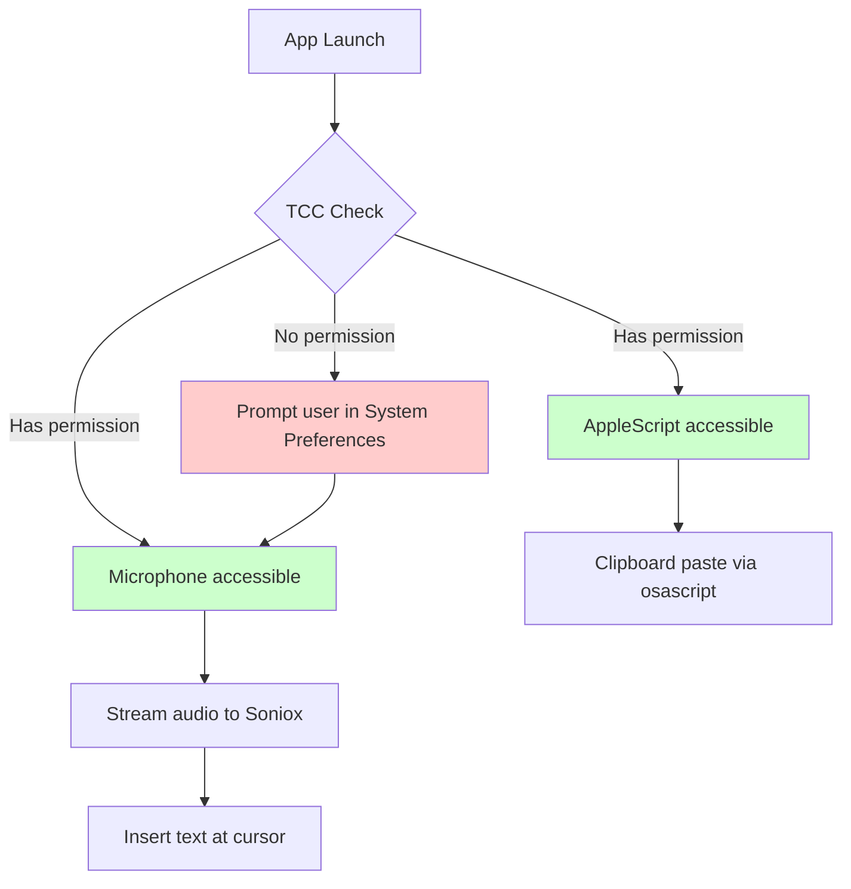

# Tauri v2 macOS Bundle Configuration for Microphone & AppleScript Use Cases

**Research Date:** 26-03-2026  
**Source:** [macOS Application Bundle Docs](https://v2.tauri.app/distribute/macos-application-bundle/), [macOS Signing Docs](https://v2.tauri.app/distribute/sign/macos/), [Configuration Reference](https://v2.tauri.app/reference/config/)

---

## 1. Info.plist Usage Strings (NSMicrophoneUsageDescription / NSAppleEventsUsageDescription)

**Claim:** Usage descriptions for microphone and AppleScript accessibility are configured via a custom `Info.plist` file in `src-tauri/`, which Tauri merges with its auto-generated plist.

**Evidence** ([macOS Application Bundle - Native configuration](https://v2.tauri.app/distribute/macos-application-bundle/#native-configuration)):

> To extend the configuration file, create an `Info.plist` file in the `src-tauri` folder and include the key-pairs you desire:
>
> ```xml
> <?xml version="1.0" encoding="UTF-8"?>
> <!DOCTYPE plist PUBLIC "-//Apple//DTD PLIST 1.0//EN" "http://www.apple.com/DTDs/PropertyList-1.0.dtd">
> <plist version="1.0">
> <dict>
>   <key>NSCameraUsageDescription</key>
>   <string>Request camera access for WebRTC</string>
>   <key>NSMicrophoneUsageDescription</key>
>   <string>Request microphone access for WebRTC</string>
> </dict>
> </plist>
> ```

**File Location:** `src-tauri/Info.plist`

**Keys for your use case:**

| Key | Purpose | TCC Impact |
|-----|---------|------------|
| `NSMicrophoneUsageDescription` | Microphone access prompt | Required for mic/TCC to work |
| `NSAppleEventsUsageDescription` | AppleScript automation prompt | Required for `osascript` paste/TCC |

**Important:** The `Info.plist` file is merged with Tauri's generated values. Avoid overwriting defaults like application version.

---

## 2. macOS Entitlements Plist Support

**Claim:** Entitlements (including `com.apple.security.device.audio-input` for microphone and AppleScript automation) are configured via a separate `Entitlements.plist` file referenced in `tauri.conf.json`.

**Evidence** ([macOS Application Bundle - Entitlements](https://v2.tauri.app/distribute/macos-application-bundle/#entitlements)):

> To define the entitlements required by your application, you must create the entitlements file and configure Tauri to use it.
>
> 1. Create a `Entitlements.plist` file in the `src-tauri` folder:
>
> ```xml
> <?xml version="1.0" encoding="UTF-8"?>
> <!DOCTYPE plist PUBLIC "-//Apple//DTD PLIST 1.0//EN" "http://www.apple.com/DTDs/PropertyList-1.0.dtd">
> <plist version="1.0">
> <dict>
>     <key>com.apple.security.app-sandbox</key>
>     <true/>
> </dict>
> </plist>
> ```
>
> 2. Configure Tauri to use the Entitlements.plist file:
>
> ```json
> {
>   "bundle": {
>     "macOS": {
>       "entitlements": "./Entitlements.plist"
>     }
>   }
> }
> ```

**File Location:** `src-tauri/Entitlements.plist`

**Relevant Entitlements for your use case:**

| Entitlement | Purpose |
|-------------|---------|
| `com.apple.security.app-sandbox` | App Sandbox (base requirement) |
| `com.apple.security.device.audio-input` | Microphone access |
| `com.apple.security.automation.apple-events` | AppleScript automation (for clipboard paste) |

---

## 3. Bundle Identifier & Product Name

**Claim:** `identifier` and `productName` in `tauri.conf.json` control the bundle identifier and app display name.

**Evidence** ([Configuration Reference - identifier](https://v2.tauri.app/reference/config/#identifier)):

> The application identifier in reverse domain name notation (e.g. `com.tauri.example`). This string must be unique across applications since it is used in system configurations like the bundle ID and path to the webview data directory.

**Configuration Location:** `src-tauri/tauri.conf.json`

```json
{
  "productName": "VoiceEverywhere",
  "identifier": "com.example.voiceeverywhere",
  "version": "1.0.0",
  "bundle": {
    "macOS": {
      "entitlements": "./Entitlements.plist"
    }
  }
}
```

**Key points:**
- `identifier` → maps to `CFBundleIdentifier` in Info.plist (bundle ID)
- `productName` → maps to app display name and `.app` bundle name
- Both must be set; identifier uniquely identifies the app for TCC

---

## 4. Packaging/Signing Settings Affecting TCC

**Claim:** Code signing and notarization configuration directly impacts TCC permission persistence.

**Evidence** ([macOS Code Signing Docs](https://v2.tauri.app/distribute/sign/macos/)):

### Signing Identity Configuration

```json
{
  "bundle": {
    "macOS": {
      "signingIdentity": "Developer ID Application: Your Name (TEAMID)",
      "entitlements": "./Entitlements.plist"
    }
  }
}
```

Or via environment variable: `APPLE_SIGNING_IDENTITY`

**Ad-hoc signing** (for development):
```json
{
  "bundle": {
    "macOS": {
      "signingIdentity": "-"
    }
  }
}
```

### Notarization (Required for Developer ID)

Notarization credentials via environment variables:

**App Store Connect API (preferred):**
- `APPLE_API_ISSUER` - App Store Connect issuer ID
- `APPLE_API_KEY` - API Key ID
- `APPLE_API_KEY_PATH` - Path to private key file

**Apple ID (fallback):**
- `APPLE_ID` - Apple account email
- `APPLE_PASSWORD` - App-specific password
- `APPLE_TEAM_ID` - Apple Team ID

### TCC Relationship

| Factor | TCC Impact |
|--------|------------|
| Signed + Notarized | TCC permissions persist across updates |
| Ad-hoc signed | TCC permissions may not persist; requires user to re-grant |
| No signing | App cannot access microphone or trigger AppleScript |

---

## 5. Info.plist Localization (Multi-language Support)

**Evidence** ([macOS Application Bundle - Info.plist localization](https://v2.tauri.app/distribute/macos-application-bundle/#infoplist-localization)):

```
src-tauri/
├── tauri.conf.json
├── infoplist/
│   ├── de.lproj/
│   │   └── InfoPlist.strings
│   ├── fr.lproj/
│   │   └── InfoPlist.strings
```

**German example (`de.lproj/InfoPlist.strings`):**
```strings
NSMicrophoneUsageDescription = "Mikrofon Zugriff wird benötigt für WebRTC Funktionalität";
NSAppleEventsUsageDescription = "Automatisierungszugriff wird benötigt für Text einfügen";
```

**Tauri resource config:**
```json
{
  "bundle": {
    "resources": {
      "infoplist/**": "./"
    }
  }
}
```

---

## 6. Complete Example Configuration

**File:** `src-tauri/tauri.conf.json`

```json
{
  "$schema": "../gen/schemas/desktop-schema.json",
  "productName": "VoiceEverywhere",
  "version": "1.0.0",
  "identifier": "com.example.voiceeverywhere",
  "build": {
    "devUrl": "http://localhost:5173",
    "frontendDist": "../dist",
    "beforeDevCommand": "npm run dev",
    "beforeBuildCommand": "npm run build"
  },
  "bundle": {
    "active": true,
    "targets": ["app", "dmg"],
    "icon": ["icons/icon.icns"],
    "macOS": {
      "entitlements": "./Entitlements.plist",
      "minimumSystemVersion": "12.0"
    }
  }
}
```

**File:** `src-tauri/Info.plist`

```xml
<?xml version="1.0" encoding="UTF-8"?>
<!DOCTYPE plist PUBLIC "-//Apple//DTD PLIST 1.0//EN" "http://www.apple.com/DTDs/PropertyList-1.0.dtd">
<plist version="1.0">
<dict>
  <key>NSMicrophoneUsageDescription</key>
  <string>VoiceEverywhere needs microphone access to transcribe your voice.</string>
  <key>NSAppleEventsUsageDescription</key>
  <string>VoiceEverywhere needs automation access to insert transcribed text at your cursor.</string>
</dict>
</plist>
```

**File:** `src-tauri/Entitlements.plist`

```xml
<?xml version="1.0" encoding="UTF-8"?>
<!DOCTYPE plist PUBLIC "-//Apple//DTD PLIST 1.0//EN" "http://www.apple.com/DTDs/PropertyList-1.0.dtd">
<plist version="1.0">
<dict>
    <key>com.apple.security.app-sandbox</key>
    <true/>
    <key>com.apple.security.device.audio-input</key>
    <true/>
    <key>com.apple.security.automation.apple-events</key>
    <true/>
</dict>
</plist>
```

---

## 7. Relevant Official Documentation Links

| Topic | URL |
|-------|-----|
| macOS Application Bundle | https://v2.tauri.app/distribute/macos-application-bundle/ |
| macOS Code Signing | https://v2.tauri.app/distribute/sign/macos/ |
| Configuration Reference | https://v2.tauri.app/reference/config/ |
| Entitlements (Apple) | https://developer.apple.com/documentation/bundleresources/entitlements |
| Info.plist Keys (Apple) | https://developer.apple.com/documentation/bundleresources/information_property_list |

---

## 8. Summary: TCC Flow for Your Use Case



**Requirements for TCC success:**
1. `Info.plist` with `NSMicrophoneUsageDescription` and `NSAppleEventsUsageDescription`
2. `Entitlements.plist` with `com.apple.security.device.audio-input` and `com.apple.security.automation.apple-events`
3. Valid code signing identity (or ad-hoc `-` for development)
4. Notarization for distribution outside App Store