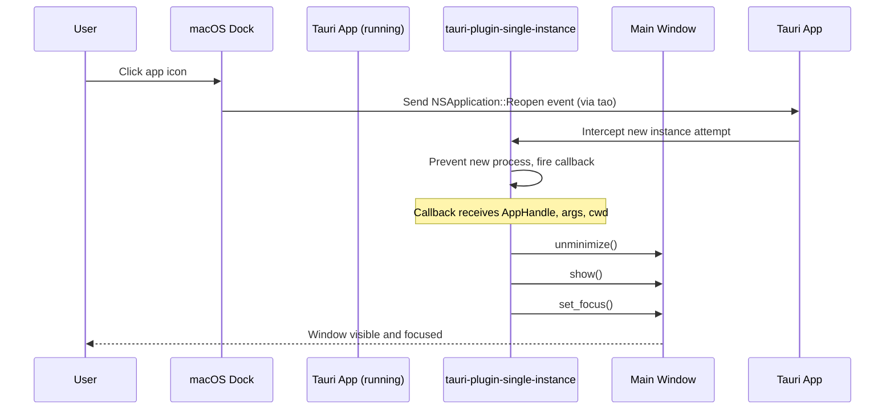

# Tauri v2 macOS App Activation/Reopen Handling

**Date**: 13.11_29-03-2026  
**Topic**: Detecting and handling macOS dock icon click when app is already running

---

## Summary

On macOS, clicking the dock icon when an app is already running triggers a **"Reopen"** event via the underlying `tao` windowing library. In Tauri v2, this is exposed through the **`tauri-plugin-single-instance`** plugin, which fires its callback when a new instance launch is attempted (including dock icon clicks on macOS).

**Key finding**: There is no separate "activate" event. The `Reopen` event from `tao` is consumed by `tauri-plugin-single-instance`, and the plugin's `init()` callback is the official integration point for handling dock icon clicks while the app is already running.

---

## API Details

### Event: `Event::Reopen` (tao)

- **Source**: [tauri-apps/tao PR #911](https://github.com/tauri-apps/tao/pull/911) and [tauri-apps/tauri PR #4865](https://github.com/tauri-apps/tauri/pull/4865)
- **What it is**: macOS `NSApplication.activate(ignoringOtherApps: true)` + `applicationShouldHandleReopen:hasVisibleWindows:` — fires when user clicks the dock icon to reopen the app
- **Status**: Merged into Tauri v2 (`dev` branch, May 7, 2024)

### Plugin: `tauri-plugin-single-instance`

- **Docs**: [v2.tauri.app/plugin/single-instance](https://v2.tauri.app/plugin/single-instance/)
- **crates.io**: [tauri-plugin-single-instance](https://crates.io/crates/tauri-plugin-single-instance)
- **GitHub**: [tauri-apps/plugins-workspace - single-instance](https://github.com/tauri-apps/plugins-workspace/tree/v2/plugins/single-instance)
- **Supported platforms**: Windows, Linux, macOS, Android, iOS (Rust ≥1.77.2 required)
- **Key behavior on macOS**: The plugin intercepts the `Reopen` event and uses it to detect when a new instance launch was attempted. The plugin prevents multiple instances and fires the callback instead.

---

## Recommended Pattern

### Step 1: Add the plugin

```bash
cargo tauri add single-instance
```

Or manually in `src-tauri/Cargo.toml`:

```toml
[target.'cfg(any(target_os = "macos", windows, target_os = "linux"))'.dependencies]
tauri-plugin-single-instance = "2"
```

### Step 2: Initialize in `lib.rs` with window focus/show logic

```rust
// src-tauri/src/lib.rs
use tauri::{AppHandle, Manager};

#[cfg_attr(mobile, tauri::mobile_entry_point)]
pub fn run() {
    let mut builder = tauri::Builder::default();

    #[cfg(desktop)]
    {
        builder = builder.plugin(tauri_plugin_single_instance::init(|app, _args, _cwd| {
            // Show, unminimize, and focus the main window
            if let Some(window) = app.get_webview_window("main") {
                let _ = window.unminimize();
                let _ = window.show();
                let _ = window.set_focus();
            }
        }));
    }

    builder
        .run(tauri::generate_context!())
        .expect("error while running tauri application");
}
```

### Why the triple (`unminimize` + `show` + `set_focus`)?

| Method | Purpose |
|--------|---------|
| `unminimize()` | Reverses `set_minimized(true)` — needed if window was minimized to dock |
| `show()` | Makes hidden window visible — needed if window was hidden via `window.hide()` |
| `set_focus()` | Brings window to front and focuses keyboard input |

All three are idempotent and safe to call even if the window is already in that state.

---

## Sequence Diagram



---

## Key References

| Item | Link |
|------|------|
| Feature request issue | [tauri-apps/tauri#3084](https://github.com/tauri-apps/tauri/issues/3084) |
| PR exposing `Event::Reopen` | [tauri-apps/tauri#4865](https://github.com/tauri-apps/tauri/pull/4865) |
| tao PR for `Activated` event | [tauri-apps/tao#911](https://github.com/tauri-apps/tao/pull/911) |
| Single-instance plugin docs | [v2.tauri.app/plugin/single-instance](https://v2.tauri.app/plugin/single-instance/) |
| Discussion: dock click handling | [tauri-apps/discussion#6600](https://github.com/orgs/tauri-apps/discussions/6600) |

---

## Notes

- The `single-instance` plugin **must be initialized first** (before other plugins) to function correctly, per the [official docs](https://v2.tauri.app/plugin/single-instance/#setup).
- No JavaScript/frontend APIs are needed for this flow — all work happens in Rust on the backend.
- No additional capabilities/permissions are required for the plugin itself.
- If the main window is named something other than `"main"`, replace accordingly in `get_webview_window("main")`.
