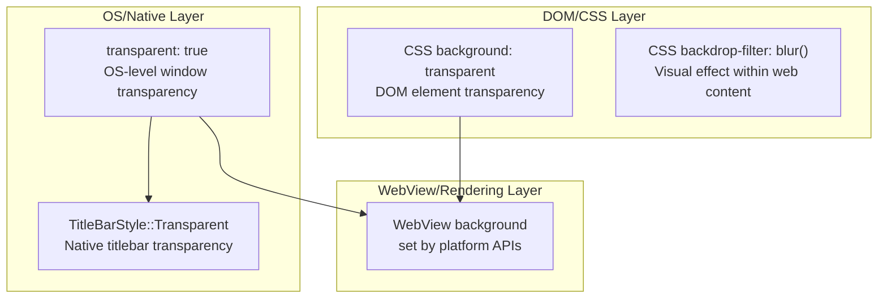

# Tauri v2 Transparent/Visual Window Design — Research Artifact

**Research Date:** 27-03-2026
**Source:** Official Tauri v2 documentation (v2.tauri.app) + upstream issue references
**Confidence:** HIGH — primary evidence from official docs, secondary from linked upstream issues

---

## 1. Transparent Window Support and Platform Limits

### Claim: `transparent: true` enables OS-level window transparency across platforms, but with macOS-specific restriction.

**Evidence** ([Window Configuration — transparent](https://v2.tauri.app/reference/config)):

> The `transparent` property determines whether the window has a transparent background. On macOS, enabling transparency requires the `macos-private-api` feature flag to be enabled under `tauri > macOSPrivateApi`. **Warning**: Using private APIs on macOS prevents your application from being accepted to the App Store.

**Platform Status:**

| Platform | Transparent Windows | Notes |
|----------|---------------------|-------|
| Windows | ✅ Supported | Effects (Mica, Acrylic, Blur) available but have resize/drag performance issues |
| macOS | ✅ Supported | **Requires** `macos-private-api` flag — blocks App Store |
| Linux | ✅ Supported | `windowEffects` unsupported (no blur/vibrancy API) |

**Evidence** ([windowEffects config](https://v2.tauri.app/reference/config)):

> Window effects. Requires the window to be transparent. On **Windows**, if using decorations or shadows, you may want to try this workaround <https://github.com/tauri-apps/tao/issues/72#issuecomment-975607891>. On **Linux**, this feature is unsupported.

**Windows Effects Caveats** (from [WindowEffect enum](https://v2.tauri.app/zh-cn/reference/config)):
- `blur`: Bad performance when resizing/dragging on Windows 11 build 22621
- `acrylic`: Bad performance when resizing/dragging on Windows 10 v1903+ and Windows 11 build 22000

**Linux Status:** Window effects (`windowEffects`) are explicitly unsupported. No vibrancy, blur, or backdrop available.

---

## 2. Transparent Titlebar / Custom Background on macOS

### Claim: `TitleBarStyle::Transparent` is the preferred approach for transparent titlebar on macOS — does NOT require `macos-private-api`.

**Evidence** ([TitleBarStyle config docs](https://v2.tauri.app/reference/config)):

> `TitleBarStyle::Transparent` — Makes the title bar transparent, so the window background color is shown instead. Useful if you don't need to have actual HTML under the title bar. This lets you avoid the caveats of using `TitleBarStyle::Overlay`.

**Implementation path:** WebviewWindowBuilder + Rust-side cocoa API calls.

**Evidence** ([macOS Transparent Titlebar with Custom Background tutorial](https://v2.tauri.app/learn/window-customization#macos-transparent-titlebar-with-custom-window-background-color)):

```rust
use tauri::{TitleBarStyle, WebviewUrl, WebviewWindowBuilder};

pub fn run() {
    tauri::Builder::default()
        .setup(|app| {
            let win_builder =
                WebviewWindowBuilder::new(app, "main", WebviewUrl::default())
                    .title("Transparent Titlebar Window")
                    .inner_size(800.0, 600.0);

            #[cfg(target_os = "macos")]
            let win_builder = win_builder.title_bar_style(TitleBarStyle::Transparent);

            let window = win_builder.build().unwrap();

            #[cfg(target_os = "macos")]
            {
                use cocoa::appkit::{NSColor, NSWindow};
                use cocoa::base::{id, nil};
                let ns_window = window.ns_window().unwrap() as id;
                unsafe {
                    let bg_color = NSColor::colorWithRed_green_blue_alpha_(
                        nil, 50.0/255.0, 158.0/255.0, 163.5/255.0, 1.0,
                    );
                    ns_window.setBackgroundColor_(bg_color);
                }
            }
            Ok(())
        })
        .run(tauri::generate_context!())
        .expect("error while running tauri application");
}
```

**Key observation:** Custom background color requires the `cocoa` crate as a platform-specific dependency and uses raw NSWindow APIs. The `#[cfg(target_os = "macos")]` conditional compilation ensures this only runs on macOS.

---

## 3. WebviewWindowBuilder vs Static Config

### Claim: Programmatic `WebviewWindowBuilder` is required when you need conditional logic (e.g., platform-specific titlebar style) or runtime-setup background color changes. Static `tauri.conf.json` suffices for simple static configurations.

**Evidence** ([Window Customization — Configuration methods](https://v2.tauri.app/learn/window-customization#configuration)):

> There are three ways to change the window configuration:
> - Through tauri.conf.json
> - Through the JavaScript API
> - Through the Window in Rust

**Evidence** (same page, macOS section):

> We are going to create the main window and change its background color from the Rust side.

**When to use WebviewWindowBuilder (programmatic):**
- Platform-conditional window config (`#[cfg(target_os = "macos")]`)
- Runtime-determined values (user preferences, screen size calculations)
- Post-creation modifications (NSWindow API calls after `build()`)
- `TitleBarStyle::Transparent` with custom background color (must use cocoa crate)

**When static config suffices:**
- `decorations: false` (frameless custom titlebar)
- `titleBarStyle: "Overlay"` (if willing to accept Overlay limitations)
- Simple `transparent: true` on non-macOS platforms
- `windowEffects` configuration

---

## 4. `macosPrivateApi` Scope — What Actually Requires It

### Claim: `macosPrivateApi` is ONLY required for `transparent: true` window config. It is NOT required for `TitleBarStyle::Transparent`, `TitleBarStyle::Overlay`, or custom background colors.

**Evidence** (comparing two official docs side-by-side):

**`transparent: true` requires it:**
> The `transparent` property determines whether the window has a transparent background. On macOS, enabling transparency requires the `macos-private-api` feature flag to be enabled under `tauri > macOSPrivateApi`. WARNING: Using private APIs on macOS prevents your application from being accepted to the App Store.

**`TitleBarStyle::Transparent` does NOT mention it:**
> `TitleBarStyle::Transparent` — Makes the title bar transparent, so the window background color is shown instead. Useful if you don't need to have actual HTML under the title bar.

**`windowEffects` does NOT mention it** (just requires `transparent: true` to be set, which on macOS implies the flag):

> Window effects. Requires the window to be transparent.

**Feature → macosPrivateApi mapping:**

| Feature | Requires macosPrivateApi | App Store Blocked |
|---------|--------------------------|-------------------|
| `transparent: true` | ✅ Yes | ✅ Yes |
| `TitleBarStyle::Transparent` | ❌ No | ❌ No |
| `TitleBarStyle::Overlay` | ❌ No | ❌ No |
| Custom NSWindow background color (cocoa) | ❌ No | ❌ No |
| `windowEffects` (blur, vibrancy) | ⚠️ Only if `transparent: true` needed | ⚠️ Only if using transparent |

**Enabling the flag** (from [tauri.conf.json schema](https://v2.tauri.app/reference/config)):
```json
{
  "tauri": {
    "macOSPrivateApi": true
  }
}
```

---

## 5. Native Window Transparency vs WebView Rendering vs DOM/CSS Transparency

### Claim: Three distinct transparency layers exist — confusing them causes skill guidance errors.



### Layer 1: Native Window Transparency (`transparent: true`)
- **What:** OS-level window transparency — the entire window chrome becomes transparent
- **Platform requirements:** 
  - Windows/Linux: Works out of the box
  - macOS: Requires `macosPrivateApi: true` (blocks App Store)
- **Use case:** True see-through windows where desktop wallpaper shows through

### Layer 2: WebView Background
- **What:** The rendering surface behind your HTML content
- **Control:** Set by the underlying platform WebView (WKWebView on macOS, WebView2 on Windows)
- **Note:** When `transparent: false` (default), this is an opaque surface

### Layer 3: DOM/CSS Transparency
- **What:** `background: transparent` or `rgba()` on HTML elements within your app
- **Scope:** Only affects that specific DOM element — completely separate from native transparency
- **Use case:** Visual overlays, glassmorphism effects within your app UI
- **Note:** `backdrop-filter: blur()` is a DOM/CSS effect — works without any native transparency

**Critical distinction for skill guidance:**

| User Asks For | Correct Approach | Wrong Assumption |
|---------------|-----------------|-----------------|
| "transparent titlebar" | `TitleBarStyle::Transparent` + NSWindow bg color | They don't need `transparent: true` |
| "see-through window" | `transparent: true` + `macosPrivateApi` (macOS) | DOM/CSS can't achieve this |
| "glassmorphism effect" | CSS `backdrop-filter: blur()` on DOM | Doesn't require native transparency |
| "vibrant macOS look" | `windowEffects` with vibrancy configs | Requires `transparent: true` on macOS |

---

## 6. Best-Practice Decision Model

### Claim: Choose based on visual goal, platform requirements, and App Store compatibility.

```
Is App Store distribution required on macOS?
├── YES → Cannot use transparent: true on macOS
│         ├── Need native-looking titlebar with custom bg?
│         │   → TitleBarStyle::Transparent + cocoa NSWindow bg
│         │   → Custom titlebar in HTML with decorations: false
│         └── Need vibrancy/blur effects?
│             → windowEffects NOT available without transparent: true
│             → Consider DOM-level backdrop-filter instead
└── NO → Full flexibility
         ├── True transparent window (show desktop behind)?
         │   → transparent: true + macosPrivateApi + windowEffects
         ├── Custom frameless window with HTML titlebar?
         │   → decorations: false + data-tauri-drag-region
         ├── macOS titlebar with custom color but native controls?
         │   → TitleBarStyle::Transparent + NSWindow.setBackgroundColor
         └── Overlay titlebar (content flows under titlebar)?
             → TitleBarStyle::Overlay + data-tauri-drag-region
             → ⚠️ Has issues: unfocused drag broken (issue #4316), height varies by OS
```

### Decision Tree Summary

| Goal | Configuration | macOSPrivateApi | App Store Safe | Caveats |
|------|--------------|-----------------|----------------|---------|
| **Frameless custom titlebar** | `decorations: false` | ❌ | ✅ | Lose native window controls; need manual `data-tauri-drag-region` |
| **Transparent titlebar, solid window** | `TitleBarStyle::Transparent` + cocoa bg | ❌ | ✅ | No HTML under titlebar area; uses native window controls |
| **Overlay titlebar** | `TitleBarStyle::Overlay` | ❌ | ✅ | Drag broken when unfocused; titlebar height varies by OS version |
| **Full transparent window** | `transparent: true` | ✅ Required | ❌ Blocks | Desktop shows through entire window |
| **Translucent DOM surfaces** | CSS `backdrop-filter`, `rgba()` | ❌ | ✅ | Works without any native config |
| **Window effects (Mica/Blur/Acrylic)** | `windowEffects` + `transparent: true` | ⚠️ On macOS | ❌ On macOS | Poor resize/drag performance on Windows; Linux unsupported |

---

## 7. Official Warnings and Specialized Path Flags

### Claim: Full transparent windows are explicitly flagged as a specialized path with trade-offs.

**Warning 1 — App Store rejection** (from [transparent config](https://v2.tauri.app/reference/config)):
> WARNING: Using private APIs on macOS prevents your application from being accepted to the App Store.

**Warning 2 — Overlay limitations** (from [TitleBarStyle docs](https://v2.tauri.app/reference/config)):
> `TitleBarStyle::Overlay` — Shows the title bar as a transparent overlay over the window's content. Keep in mind:
> - The height of the title bar is different on different OS versions, which can lead to window controls and title not being where you don't expect.
> - You need to define a custom drag region to make your window draggable, however due to a limitation you can't drag the window when it's not in focus https://github.com/tauri-apps/tauri/issues/4316.
> - The color of the window title depends on the system theme.

**Warning 3 — Windows effects performance** (from [WindowEffect enum](https://v2.tauri.app/zh-cn/reference/config)):
> blur: Has bad performance when resizing/dragging the window on Windows 11 build 22621
> acrylic: Has bad performance when resizing/dragging the window on Windows 10 v1903+ and Windows 11 build 22000

**Warning 4 — Linux unsupported** (from [windowEffects config](https://v2.tauri.app/reference/config)):
> On **Linux**, this feature is unsupported.

**Warning 5 — Custom titlebar loses native functions** (from [Window Customization tutorial](https://v2.tauri.app/learn/window-customization)):
> Note: For macOS, using a custom titlebar will also lose some features provided by the system, such as moving or aligning the window. Another approach to customizing the titlebar but keeping native functions could be making the titlebar transparent and setting the window background color.

### Upstream Issue Referenced

**Issue #4316** — Overlay titlebar drag when unfocused:
- **URL:** https://github.com/tauri-apps/tauri/issues/4316
- **Impact:** `TitleBarStyle::Overlay` cannot drag window when app is not in focus
- **Official doc reference:** TitleBarStyle overlay caveats

**tao Issue #72** — Windows decorations/shadows workaround:
- **URL:** https://github.com/tauri-apps/tao/issues/72#issuecomment-975607891
- **Impact:** Windows workaround needed for windowEffects when using decorations or shadows

---

## Skill Guidance Section

### Tauri v2 Transparent/Visual Window — Quick Reference

**For skill/agent guidance, use this decision hierarchy:**

1. **Default recommendation:** `decorations: false` with HTML custom titlebar + `data-tauri-drag-region` for full control. App Store safe on macOS.

2. **If native macOS titlebar preferred but with custom color:** Use `WebviewWindowBuilder::title_bar_style(TitleBarStyle::Transparent)` + `NSWindow.setBackgroundColor_()` via cocoa crate. App Store safe. Requires Rust-side conditional compilation.

3. **If you need true transparent window (desktop visible):** Set `transparent: true` in config. On macOS this requires `macosPrivateApi: true` which BLOCKS App Store. Document this trade-off explicitly to users.

4. **If you want vibrancy/blur effects:** Use `windowEffects` (macOS: many options; Windows: Mica/Acrylic/Blur with performance caveats; Linux: unsupported). Requires `transparent: true` on macOS.

5. **If you want "glass inside app" look only:** CSS `backdrop-filter: blur()` + `rgba()` backgrounds. No native config needed. Works everywhere.

6. **Avoid `TitleBarStyle::Overlay`** unless unfocused drag is acceptable and OS version height differences are tolerable.

**Critical distinctions to communicate:**
- `transparent: true` ≠ CSS `background: transparent` (these are completely different layers)
- `TitleBarStyle::Transparent` does NOT require `macosPrivateApi`
- `macosPrivateApi` only blocks App Store for `transparent: true`, not for titlebar customization

---

## Evidence Summary

| Claim | Evidence URL | Confidence |
|-------|-------------|------------|
| transparent:true requires macOSPrivateApi | https://v2.tauri.app/reference/config | HIGH |
| TitleBarStyle::Transparent does NOT require macOSPrivateApi | https://v2.tauri.app/reference/config | HIGH |
| Overlay drag issue #4316 | https://v2.tauri.app/reference/config | HIGH |
| Linux windowEffects unsupported | https://v2.tauri.app/reference/config | HIGH |
| Windows blur/acrylic performance issues | https://v2.tauri.app/zh-cn/reference/config | HIGH |
| Custom titlebar loses native macOS functions | https://v2.tauri.app/learn/window-customization | HIGH |
| WebviewWindowBuilder required for conditional/titlebar+bg | https://v2.tauri.app/learn/window-customization | HIGH |
| Three config paths (json/js/rust) | https://v2.tauri.app/learn/window-customization | HIGH |
| Windows workaround for decorations+effects | https://v2.tauri.app/reference/config (linked) | MEDIUM |
